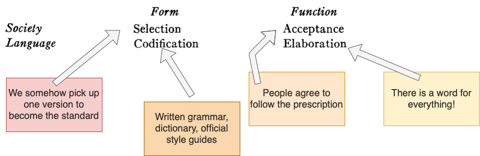
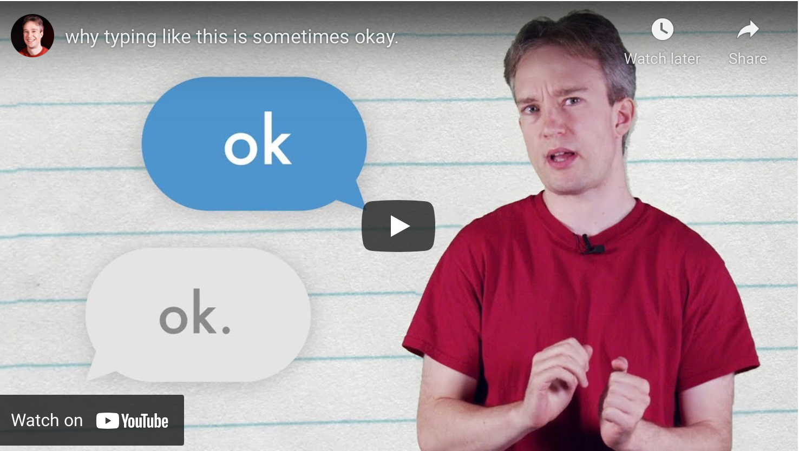
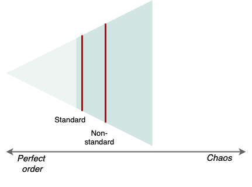
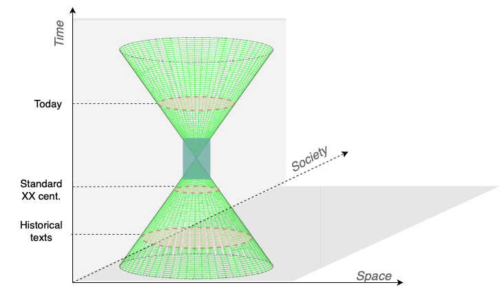
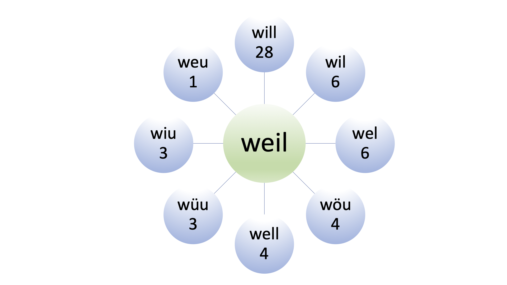
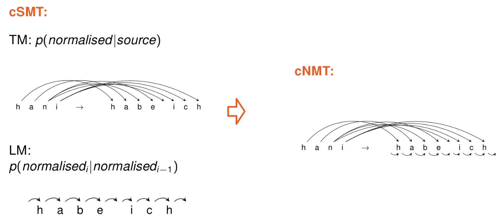
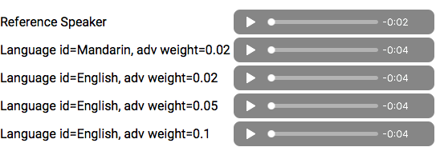

Tanja Samardžić,  Tutorial at the Mexican NLP Summer School, 2 June 2021

# Language (de)standardisation and NLP 

The term non-standard language covers all linguistic expressions not conforming to an official orthography and pronunciation. Such expressions include dialects (written and spoken), historical texts and social media posts. They require special processing techniques in order to deal with the fact that the same word can be written (or pronounced) very differently in the same text (or recording). This tutorial provides an introduction to the notion of language standard and an overview of the challenges that increasingly non-standard writing and speech pose to NLP. 

Learning objectives for you: 

- Big picture: know how to think about the problems
- Know where to look for solutions, data, code, new ideas

 

---
### 1. What is standard language? 

 

This is an idea that developed in the XIX century Europe, when most of its present-day states were formed. It was part of the (romantic) unifying tendencies: people within one state needed to use the same language. Although it might look today as something that happened spontaneously and naturally, language standardisation is the result of planned efforts and explicit political decisions.  

Source: 

- Einar Haugen (1966), [Dialect, Language, Nation](https://anthrosource.onlinelibrary.wiley.com/share/VHDXIIS4K43WSXKETNBW?target=10.1525/aa.1966.68.4.02a00040), American Anthropologist. 

##### Politics, power and the question of who decides what is correct in language 

All four aspects of standard languages (selection, acceptance, codification, elaboration) are extremely sensitive to delicate equilibriums in societies. The way we use language is an inherent part of who we are. Not following linguistic norms imposed by the institutions is often seen as an act of rebellion, even treason. This is why language standardisation often boils down to the question of dominance, that is who decides the rules, who has the power to impose them. 

##### Popular misconceptions 

- "Standard is cultivated by suppressing non-standard"   
WRONG! Humans are capable and should be encouraged to master multiple varieties 

-  "Non-standard is dangerous"  
WRONG! The danger is only in the totalitarian mind  

There are many examples in history where imposing a particular language or variety on a given territory was so important that it created violence. Some famous examples include language marches in India and colonial practices especially in Africa. More subtle imposing practices are still very widely spread, everywhere. We are easily ridiculed for the way how we speak, often regarded as less worthy or capable if we don't follow the standard. 

The case of my own language, which I don't know how to name after all, is a curious example of how absurd things can get whe people try to create four standard languages out of the same dialect. Here is our paper where you can read more about it:

- Ljubešić et al. (2019) [Borders and boundaries in Bosnian, Croatian, Montenegrin and Serbian: Twitter data to the rescue](https://drive.switch.ch/index.php/s/X76nwFMdq1VRt1i), Linguistic Geography.   

 

---
### 2. Good and bad sides of language standardisation

 

Source: 

-  Gretchen McCulloch   [Resources](https://gretchenmcculloch.com/resources/)

 

 

|         | Standard |  Non-standard |
|:--------|:----------|:---------------| 
| __Good__  | <ul> <li >Broader unity </li> <li>Clarity</li><li>Easy to process</li> </ul> | <ul><li>Expressiveness</li></li>  <li>Fun </li> <li>Local identity</li> </ul> |  
| __Bad__   |<ul> <li>Pressure on minorities</li> <li>Flatness</li> <li>Hard to maintain</li></ul>  | <ul> <li>Hard to process</li><li>Hard to process!!</li><li>Hard to process!!!</li></ul>| 

 

___

__BREAK__

--- 

 

### 3. Standard vs. non-standard across time, space, society

The first language processing algorithms started being developed at the point in time when language standardisation was at its peak (in those few languages that did go through the process of standardisation).  This is how the idea of a single "correct" spelling became an inherent part of language technology. Until recently, "correct" spelling was necessary in order to use computers at all, to perform internet searches, for instance, or dictionary look-up. 

In the meantime, computers not only became more flexible, but they also contributed to a new wave of language diversification. With the spread of the internet, non-edited writing pours into the public space bringing more fun but also more challenges for processing. 

  

Cones borrowed from an [Introduction to Conic Sections](https://www.ck12.org/section/introduction-to-conic-sections/)

- Variation in space: dialects, regional varieties 
- Variation in society: registers, styles 

Non-standard writing is basically everywhere in time and space: it was there before the state-driven standardisation, it was there (although not so visible) in the era of standards, and it is here now, very visible and intriguing! 

---

 

### 4. Non-standard language in text understanding (analytics)

#### Spelling correction

> "The disruptive Bell Atlantic and Pacific Bell telephone network outages that occurred during the summer of 1991 were due in part to a __typographical error__ in a software patch."

Source: 
- Karen Kukich (1992), [Techniques for automatically correcting words in text](https://doi.org/10.1145/146370.146380)

This is an extreme case illustrating well the context where __correct spelling__ is extremely important, but we need to understand that this is not always the case. 

Traditional methods for spelling correction rely on large dictionaries. Ideally, such dictionaries would list all correct words in a language, and then we just need to have efficient algorithms to search these dictionaries. The problem with this approach is that it is not possible to list all correct words of a language since such a set would be __infinite__ even in a perfectly standardised language. Thinking that the set of words is finite is one of the biggest illusions about language. This quote by the famous lexicographer Patrick Hanks provides some ideas of why one can never make a complete list of all words:

> Should _strobilus_, _strobila_, _strobilation_ be entries [in a dictionary]?  [...]  Native-speaker dictionary users expect the inventory of words in a dictionary to be complete, and the lexicographer must find ways of satisfying that expectation, despite the fact that the goal is impossible: the lexicon of a living language is dynamic and the boundaries of its vocabulary are fuzzy, so that new words and expressions are being coined — invented or borrowed — all the time.

Source:

- Patrick Hanks (2010), [Compiling a Monolingual
Dictionary for Native Speakers](http://www.patrickhanks.com/uploads/5/1/4/9/5149363/compiling_a_monoligual_dictionary.pdf) 

Despite these limitations, the long tradition of spelling correction provides some useful help. A rather popular project that helped many people get their spelling right is:

- [GNU Aspell](http://aspell.net)

I myself use spelling correction a lot, including in writing this tutorial. Strangely enough, I feel strongly bothered by spelling errors and try to avoid them by all means. As imperfect as it is, automatic correction still makes up for my lacking memory. How about you?

#### Normalisation

Spelling correction can be seen as a specific case of a broader field of text __normalisation__. Even if there is no right spelling in some language (it has not undergone standardisation at all) and if we don't care whether something is written "correctly", we want to map all variants of a single word to a single meaning. 

Although we will find it quite impossible to explain why and how, we humans have no problems figuring out that `so` and `sooo` are slightly different variants of the same word while `so` and `soap` are entirely different words. Because we don't know how we do this, making computers figure this out for us is very difficult. It involves a lot of surprises and hidden problems that have been a long-lasting topic of research. For instance, what if we see `soao` in some text. Is it `sooo` or `soap` or, for some reason really `soao`? Again, humans somehow get these things right, computers not at all.

##### Swiss German example  

Data download:

- [WUS](https://drive.switch.ch/index.php/s/chlu1xuLzfQ0kBi), experimental data set from the project [What's Up, Switzerland?](https://www.whatsup-switzerland.ch/index.php/en/corpus-en), reference paper: [Lusetti et al. 2018](http://aclweb.org/anthology/W18-3902)  
- [ArchiMob](https://www.spur.uzh.ch/en/departments/research/textgroup/ArchiMob.html), normalised transcriptions of spoken Swiss German, reference papers [Samardžić et al. 2016](http://www.lrec-conf.org/proceedings/lrec2016/pdf/801_Paper.pdf), [Scherrer et al. 2019](https://link.springer.com/article/10.1007/s10579-019-09457-5)  

A (simplified) example from WUS:

##### Overview of NLP approaches to normalisation

- Devopedia, [Text normalisation](https://devopedia.org/text-normalization) 
- Tim Baldwin, [Natural Language Processing for User Generated Content](https://drive.google.com/drive/folders/1UuSd9mo6PAsrMaS2arIjr_26s-kz52zV), ALPS2021 lectures 

Most techniques adapted from other NLP tasks, especially morphological processing (word-level transducers) and machine translation. 

 

This is an example of how machine translation is adapted:

 

My overview:

| General framework | General technology | How it works | Pros | Contras |
|:-----------|:-----------|:-----------|:-----------|:-----------|
|   |   |   |   |   | 
| Rule-based | Finite state transducers, e.g. [xfst](https://web.stanford.edu/~laurik/fsmbook/home.html), [hfst](http://hfst.github.io), [OpenFst](http://www.openfst.org/twiki/bin/view/FST/WebHome)  | You write a large set of rules using the exact formalism required by the software, the software reads your rules and applies them to transform any given input| No need for training data, your knowledge is enough| You quickly understand how little you know, rules get complicated with small coverage, needs to be manually updated |  
|   |   |   |   |   | 
|Statistical machine translation with IBM models (cSMT)| [Moses toolkit](http://www.statmt.org/moses/?n=Moses.Baseline)   |  Like machine translation, just that we "translate" characters instead of words | You can train a model on your laptop, works better for this task than for actual translation | You need training data e.g. our Swiss German data sets |
|   |   |   |   |   |
|Neural transducers with LSTMs | There are many, e.g. [Hard attention transducer](https://github.com/roeeaharoni/morphological-reinflection) by Aharoni , [Multilevel approach](https://github.com/tatyana-ruzsics/uzh-corpuslab-normalization) by Ruzsics, check the last section for more | Similar as with cSMT, but quickly gets too much for your laptop | More flexible than cSMT, more opportunities for improvements  | Needs more data and computation, hard to see big improvements |
|  |   |   |   |   |
|Neural translation with Transformers |  There are many, e.g. [ G2P toolkit]( https://github.com/cmusphinx/g2p-seq2seq)  | Similar as above, just that you need to mimic the grapheme representation on the target side  | Works considerably better  than other systems | Needs GPUs and generally more recent technology |

---

__BREAK__

---

 

### 5. Non-standard language in text generation

Currently big trend: writing machines! 

Recent Nature long read:

- Matthew Hutson, [Robo-writers: the rise and risks of language-generating AI](https://www.nature.com/articles/d41586-021-00530-0)

But how do we achieve natural variation in the written output?

Style transfer in images:

 

Source:
- [HackerWorld](https://hackerworld.co/how-do-these-neural-network-style-transfer-tools-work)

Something similar in audio:

Source:
- Voice cloning [Google](https://google.github.io/tacotron/publications/multilingual/index.html)

In text? There is some work on making texts polite, but we can expect more of this research in the future.

---
### 6. Relevant NLP workshops (ACL)

- [VarDial](https://sites.google.com/view/vardial2021): Workshop on NLP for Similar Languages, Varieties and Dialects 
- [W-NUT](http://noisy-text.github.io/2021/#tasks): Workshop on Noisy User-generated Text
- [SIGMORPHON](https://sigmorphon.github.io/workshops/): Workshop of the Special Interest Group on Computational Morphology and Phonology

---

Q&A, DISCUSSION

___